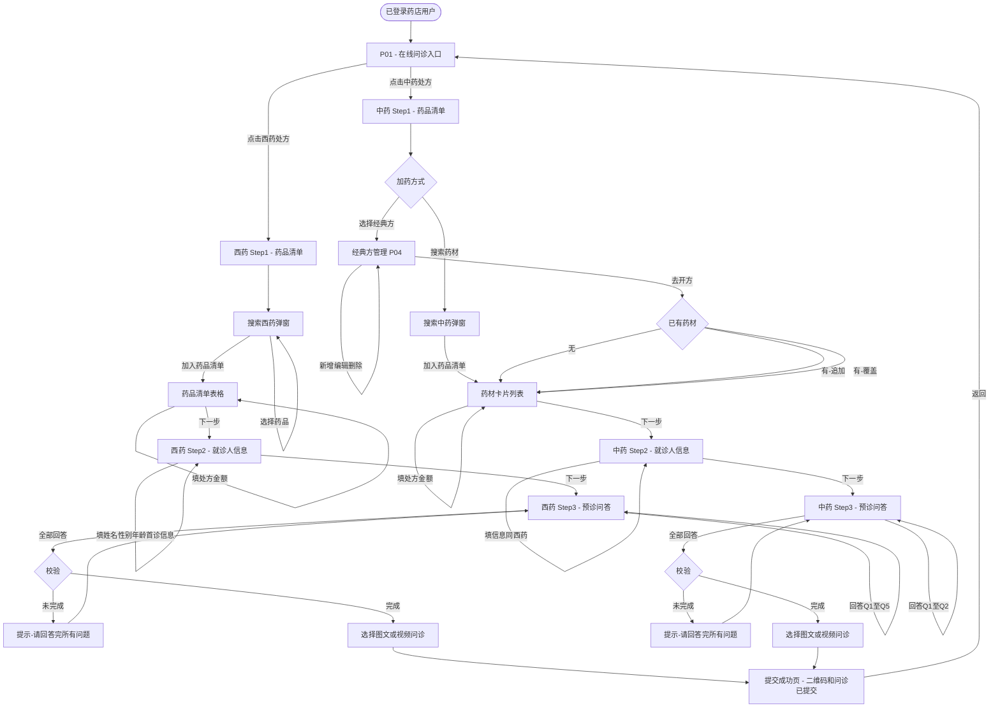
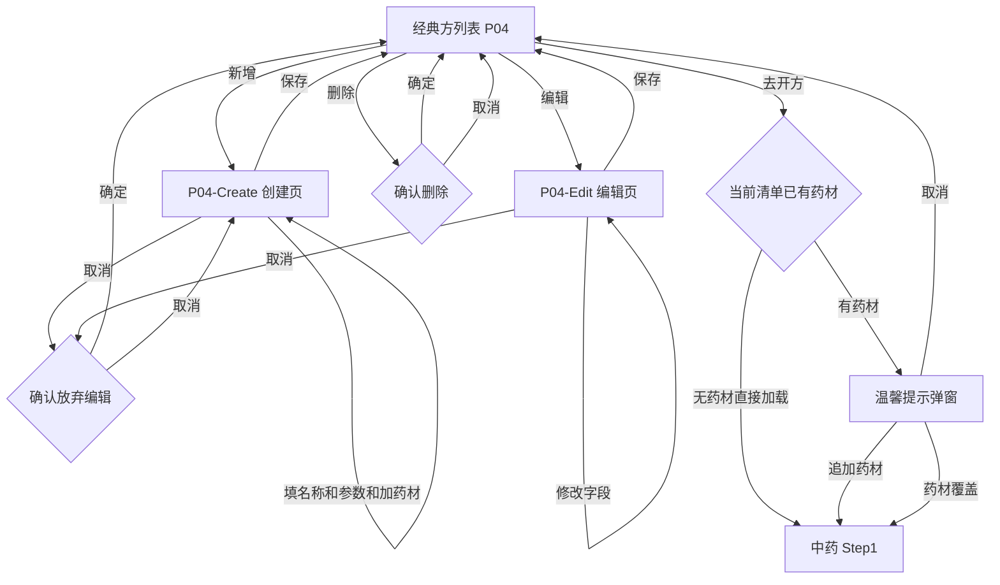

# 在线问诊 — 业务流程梳理

> **梳理日期**: 2026-06-21  
> **事实来源**: `web-test/01-页面探索/登录用户探索记录.md`  
> **梳理方法**: 仅基于页面探索记录中已确认的事实，不补充未观察到的业务规则  

---

## 一、角色与业务目标

### 1.1 涉及角色

| 角色 | 说明 | 事实来源 |
|------|------|---------|
| 未登录用户 | 访问登录页面的用户 | E01 |
| 已登录药店用户 | 选择药店机构后进入系统的用户，代表某药店操作 | E02、E03 |

> **本次梳理仅覆盖"已登录药店用户"在在线问诊模块中的操作流程。**
> 注册、支付、后台管理角色不在本轮探索范围内。

### 1.2 业务目标

已登录药店用户的核心业务目标：

| 编号 | 目标 | 说明 |
|------|------|------|
| G1 | 为就诊人开具西药处方问诊单 | 搜索西药 → 配置用法用量 → 填写就诊人信息 → 回答预诊问题 → 选择图文问诊（文字+图片交流）或视频问诊（开启实时视频通话）提交 |
| G2 | 为就诊人开具中药处方问诊单 | 搜索中药或选择经典方 → 配置剂数煎法 → 填写就诊人信息 → 回答预诊问题 → 选择图文问诊或视频问诊提交 |
| G3 | 管理中药经典方模板 | 新增/编辑/删除经典方，便于快速复用处方向 |

---

## 二、主流程

### 2.1 流程F1：西药处方 — 搜索药品 → 图文问诊提交

- **角色**：已登录药店用户
- **业务目标**：G1 — 为就诊人开具西药处方问诊单
- **起始状态**：用户已登录并选择药店机构，处于在线问诊入口页（P01）
- **结束状态**：问诊提交成功页（二维码 + "问诊已提交"），等待微信小程序完成问诊

#### 步骤

| 步骤 | 操作 | 页面状态变化 | 事实来源 |
|------|------|-------------|---------|
| 1 | 在 P01 点击"西药处方"图片入口 | 进入西药处方 Step1（药品清单），初始已选0种药品 | E04、E05 |
| 2 | 点击搜索框，弹出"请选择首诊时医生开具的药品"对话框 | 弹窗覆盖主页面，搜索历史可见，初始无结果 | E05 |
| 3 | 输入关键词（支持空格分隔多条件，如"阿莫西林 好医生"）并点击"搜 索" | 显示搜索结果：药品名称、规格、厂家，每条有"选择"按钮 | E05 |
| 4 | 点击某药品的"选择"，该药标记为已选 | 底部计数"已选择 N 种药品"更新 | E05 |
| 5 | 可继续搜索并选择更多药品（支持多次搜索、跨页选择） | 累计选中数量递增 | E05 |
| 6 | 点击"加入药品清单" | 弹窗关闭，选中药品以表格形式显示在 Step1 主页面 | E05、E06 |
| 7 | 为每味药分别设置用法（combobox）、单次用量（spinbutton+单位）、用药频次（combobox） | 每行药品的配置独立变更 | E06 |
| 8 | 可选：填写处方金额（文本框，单位"元"） | 金额字段填充 | E06 |
| 9 | 点击疾病诊断标签选择一个诊断（如"呼吸道感染"） | 诊断标签高亮选中 | E06 |
| 10 | 点击"下一步，填写就诊人" | 进入西药处方 Step2 | E07 |
| 11 | 填写就诊人信息：姓名(*)、性别(*)、年龄(*)，可选填身份证、电话。也可点"历史就诊人"一键填充全部 | 表单字段填充 | E07 |
| 12 | 填写首诊信息：首诊机构、首诊时间（通过日历控件选择） | 首诊字段填充 | E07 |
| 13 | 点击"下一步，预诊问答" | 进入西药处方 Step3 | E08 |
| 14 | 依次回答 5 个预诊问题（Q1-Q5） | 每个答案选中（视觉反馈较弱） | E08 |
| 15 | 确认诊断（步骤1所选诊断锁定显示，带🔒图标） | — | E08 |
| 16 | 点击"图文问诊"（或"视频问诊"）—— 图文问诊以文字+图片交流；视频问诊发起实时视频通话 | 按钮进入 loading 状态 | E08 |
| 17 | 等待提交完成 | → 成功页：显示二维码 + "问诊已提交" + 操作提示 | E09 |

#### 流程结束

用户可选择"返回"回到 P01 在线问诊入口，或扫码去小程序继续问诊。

> **已确认**：问诊一旦提交，不能取消。用户不能在系统内撤回已提交的问诊单。

---

### 2.2 流程F2：中药处方 — 普通搜索 → 图文问诊提交

- **角色**：已登录药店用户
- **业务目标**：G2 — 通过搜索中药材开具中药处方问诊单
- **起始状态**：用户已登录，处于在线问诊入口页（P01），已选0种药品
- **结束状态**：问诊提交成功页

#### 步骤

| 步骤 | 操作 | 页面状态变化 | 事实来源 |
|------|------|-------------|---------|
| 1 | 在 P01 点击"中药处方"图片入口 | 进入中药处方 Step1（药品清单），初始0味药，有"选择经典方"按钮 | E10 |
| 2 | 点击搜索框 → 弹出药品搜索对话框（标题"请选择首诊时医生开具的药品"） | 弹窗覆盖主页面 | E10 |
| 3 | 输入中药材名称关键词并搜索 | 显示药材名称列表（无规格/厂家），每条有"选择"按钮 | E10 |
| 4 | 选择药材 → 点击"加入药品清单" | 弹窗关闭，药材以卡片式显示（名称 + 用量spinbutton + 单位combobox） | E10 |
| 5 | 调整每味药的用量和单位（如 2.50 g） | 单药用量变更 | E10 |
| 6 | 设置全局参数：剂数（spinbutton）、煎法（combobox，如泡服/水煎服）、每日剂数、每日频次 | 全局参数变更，提示"（每剂 N 味药）"动态更新 | E10 |
| 7 | 可选：填写处方金额 | 金额字段填充 | E10 |
| 8 | 点击诊断搜索区域 → 弹出"选择诊断"弹窗 → 输入名称搜索 → 选择诊断 → 点击"确定" | 诊断标签显示在主页面（可删除） | E10 |
| 9 | 点击"下一步，填写就诊人" | 进入中药处方 Step2 | E15 |
| 10 | 填写就诊人信息 + 首诊信息（同西药Step2） | 同西药 | E15 |
| 11 | 点击"下一步，预诊问答" | 进入中药处方 Step3 | E16 |
| 12 | 回答 2 个预诊问题（Q1-Q2，比西药少3个） | 答案选中 | E16 |
| 13 | 确认诊断（锁定带🔒图标） | — | E16 |
| 14 | 点击"图文问诊" | 按钮进入 loading 状态 | E16 |
| 15 | 等待提交完成 | → 成功页（与西药相同） | E17 |

---

### 2.3 流程F3：中药处方 — 经典方"去开方" → 图文问诊提交

- **角色**：已登录药店用户
- **业务目标**：G2 — 通过经典方模板快速开具中药处方
- **起始状态**：用户处于中药处方 Step1（药品清单），可能已有药材或为空
- **结束状态**：问诊提交成功页

#### 分支说明

经典方"去开方"包含 **追加/覆盖** 的分支判断（详见 §3.2 分支B1）。

#### 步骤（以**空白表单**+去开方为例）

| 步骤 | 操作 | 页面状态变化 | 事实来源 |
|------|------|-------------|---------|
| 1 | 在中药处方 Step1 点击"选择经典方" | 跳转到经典方管理页（P04） | E10、E11 |
| 2 | 浏览经典方列表或搜索经典方名称 | 列表更新 | E11 |
| 3 | 点击某个经典方的"去开方"按钮 | 若当前清单为空 → 直接加载；若已有药材 → 弹出追加/覆盖对话框 | E11 + 补充验证 |
| 4a | 若弹框：选择"追加药材" | 保留已有药材，追加经典方药材到清单 | 补充验证 |
| 4b | 若弹框：选择"药材覆盖" | 清空已有药材，替换为经典方药材 | 补充验证 |
| 5 | 返回中药处方 Step1，药材已加载 | 清单显示经典方药材 + 全局参数（剂数/煎法等）随经典方带入 | E11 |
| 6 | 可继续手动搜索添加更多药材 | 同 F2 步骤 2-4 | E10 |
| 7 | 调整用量/剂数/煎法等参数 | 同 F2 步骤 5-6 | E10 |
| 8 | 后续步骤同 F2 步骤 7-15 | → 最终提交 | E15-E17 |

---

### 2.4 流程F4：经典方模板管理（CRUD）

- **角色**：已登录药店用户
- **业务目标**：G3 — 管理中药经典方模板
- **起始状态**：用户处于经典方管理页（P04）
- **结束状态**：返回经典方列表或中药处方 Step1

#### F4a：新增经典方

| 步骤 | 操作 | 页面状态变化 | 事实来源 |
|------|------|-------------|---------|
| 1 | 点击"新增经典方"按钮 | 跳转到创建页 P04-Create | E12 |
| 2 | 输入经典方名称 | textbox 填充 | E12 |
| 3 | 设置总剂数/每日剂数/煎法/每日服用（combobox） | 各字段变更 | E12 |
| 4 | 搜索药材 → 添加到药材组成列表 | 药材列表更新，计数变化 | E12 |
| 5a | 点击"保存中药经典方" | → 保存成功，返回列表页 | E12 |
| 5b | 点击"取消" → 弹出"确认放弃编辑？未保存的内容将丢失" → 确认 | → 返回列表页，不保存 | E12 |

#### F4b：编辑经典方

| 步骤 | 操作 | 页面状态变化 | 事实来源 |
|------|------|-------------|---------|
| 1 | 点击某个经典方的"编辑处方" | 跳转到编辑页 P04-Edit/{uuid}，所有字段预填充 | E13 |
| 2 | 修改任意字段（名称/参数/药材组成） | 字段变更，UI行为同新增 | E13 |
| 3a | 点击"保存中药经典方" | → 保存成功，返回列表页 | E13 |
| 3b | 点击"取消" → 确认弹窗 → 确定 | → 返回列表页，不保存 | E13 |

#### F4c：删除经典方

| 步骤 | 操作 | 页面状态变化 | 事实来源 |
|------|------|-------------|---------|
| 1 | 点击某个经典方的"删除模板" | 弹出确认弹窗："确认删除该模板？删除后无法恢复" | E14 |
| 2a | 点击"确定" | → 模板被删除，从列表移除 | E14 |
| 2b | 点击"取消" | → 弹窗关闭，模板保留 | E14 |

---

## 三、分支与异常流程

### 3.1 分支B1：经典方"去开方" — 追加 vs 覆盖

- **触发条件**：当前药品清单已有 N 味药材（N≥1），用户通过经典方列表点击"去开方"
- **事实来源**：补充 Playwright 验证（2026-06-21） + 用户补充确认

```
已有药材 ──→ 点击"去开方" ──→ 弹出"温馨提示"
                                    │
                    ┌───────────────┼───────────────┐
                    ▼               ▼               ▼
               "取 消"        "追加药材"      "药材覆盖"
               关闭弹窗      保留已有+追加     清空已有+替换
               药材不变      经典方药材       经典方药材
                             (同名药材覆盖)
```

**弹窗内容**（已确认）：
- 标题："温馨提示"
- 文案："当前已选 N 味药材，是否用经典方覆盖？"
- 按钮：取消 / 追加药材 / 药材覆盖

**追加药材时的同名处理**（已确认）：
- 若经典方中有与当前清单同名的药材 → 用量覆盖（替换为经典方的值），不重复添加

### 3.2 分支B2：西药 vs 中药诊断选择方式

| 对比维度 | 西药处方 | 中药处方 |
|---------|---------|---------|
| 交互方式 | 标签列表直接点击选择 | 弹窗搜索 → 选诊断 → 确定 |
| 多选 | 单个标签（互斥） | 单条诊断 |
| 搜索能力 | 无（标签列表固定） | 支持诊断名称搜索 |
| 事实来源 | E06 | E10 |

### 3.3 分支B3：西药 vs 中药预诊问题差异

| 问题 | 西药处方 | 中药处方 | 事实来源 |
|------|---------|---------|---------|
| Q1: 以往是否应用过所选药物 | ✅ | ✅ | E08、E16 |
| Q2: 以往有无过敏反应 | ✅ | ✅ | E08、E16 |
| Q3: β-内酰胺类药物过敏史 | ✅ | ❌ | E08 |
| Q4: 肾功能是否正常 | ✅ | ❌ | E08 |
| Q5: 是否有以下疾病或病史 | ✅ | ❌ | E08 |

> **推断**：中药处方预诊问题较少，可能因中药风险模型不含抗生素/肝肾毒性评估。预诊问题内容可能根据所选药品动态生成（西药含阿莫西林 → 触发β-内酰胺类/肾功能问题）。

### 3.4 异常流程A1：预诊问题未全部回答

- **触发条件**：用户在步骤3未回答所有必答问题，直接点击"图文问诊"/"视频问诊"
- **系统行为**：弹出提示"请回答完所有问题！"，阻止提交
- **用户恢复路径**：关闭提示，逐一回答所有问题后重新点击提交
- **事实来源**：E08（已确认：非实时校验，点击提交时才触发）
- **影响**：用户需返回查看哪些问题未回答（因选中状态视觉反馈弱）

### 3.5 异常流程A2：药品搜索无结果

- **触发条件**：搜索关键词未匹配到任何药品/药材
- **系统行为**：显示默认提示信息（无匹配结果）
- **用户恢复路径**：修改搜索关键词或清空后重新搜索

### 3.6 异常流程A3：API连接失败

- **触发条件**：后端 `eh-api.hyshospital.com` 偶发 ERR_CONNECTION_CLOSED
- **系统行为**：Network Error，重试后可恢复
- **事实来源**：探索记录第九章

### 3.7 异常流程A4：经典方删除确认

- **触发条件**：用户点击"删除模板"
- **系统行为**：弹出二次确认："确认删除该模板？删除后无法恢复"
- **用户恢复路径**：点击"取消"放弃删除
- **事实来源**：E14

### 3.8 异常流程A5：经典方编辑放弃确认

- **触发条件**：用户在新增/编辑经典方页面修改后点击"取消"
- **系统行为**：弹出"确认放弃编辑？未保存的内容将丢失"
- **用户恢复路径**：取消 → 继续编辑；确定 → 放弃修改
- **事实来源**：E12

---

## 四、状态流转

### 4.1 问诊单据状态

```
[P01 在线问诊入口]
       │
       ├── 西药处方 ──→ [Step1 药品清单(初始)] ──→ [Step1 药品清单(已选药)] ──→ [Step2 就诊人信息] ──→ [Step3 预诊问答] ──→ [提交成功]
       │
       └── 中药处方 ──→ [Step1 药品清单(初始)] ──→ [Step1 药品清单(已选药)] ──→ [Step2 就诊人信息] ──→ [Step3 预诊问答] ──→ [提交成功]
                              │
                              └──→ [经典方管理 P04] ──→ [新增/编辑] ──→ 返回列表
                                                       ──→ [去开方] ──→ 返回 Step1(药材已加载)
                                                       ──→ [删除] ──→ 列表更新
```

### 4.2 页面间可回退路径

| 当前页面 | 可回退到 | 操作 |
|---------|---------|------|
| 西药/中药 Step1 | P01 在线问诊入口 | 点击"返回"按钮 |
| 西药/中药 Step2 | 同类型 Step1 | 点击"返回上一步"（**注意**：Step2 的"返回上一步"先回到Step1，不是直接回P01） |
| 西药/中药 Step3 | 同类型 Step2 | 点击"返回上一步" |
| 提交成功页 | P01 在线问诊入口 | 点击"返回"按钮 |

> **已确认**：步骤向导支持"返回上一步"逐步回退，数据保留在上一步表单中。

### 4.3 经典方页面状态

```
[中药Step1] ──选择经典方──→ [经典方列表 P04]
                                  │
                    ┌─────────────┼─────────────┐
                    ▼             ▼             ▼
              [新增 P04-Create]  [编辑 P04-Edit/{uuid}]  [去开方]
                    │             │                  │
                    └──保存/取消──┘                  │
                         │                          │
                         ▼                          ▼
                    [经典方列表]            [中药Step1(药材加载)]
```

---

## 五、跨步骤数据

### 5.1 药品/药材数据流转

| 数据 | 产生位置 | 传递路径 | 使用位置 | 备注 |
|------|---------|---------|---------|------|
| 药品名称+规格+厂家 | 搜索弹窗(选择) | → 加入药品清单 → 表格 | Step1 药品清单表格 | 西药 |
| 药材名称 | 搜索弹窗(选择) | → 加入药品清单 → 卡片列表 | Step1 药材列表 | 中药 |
| 药材名称+用量+单位 | 经典方模板 | → 去开方 → 加载到Step1 | Step1 药材列表 | 中药材通过经典方 |
| 单药用法 | Step1 combobox | → 提交时发送 | 后端 | 西药特有 |
| 单药单次用量+单位 | Step1 spinbutton | → 提交时发送 | 后端 | 西药+中药均有 |
| 单药用药频次 | Step1 combobox | → 提交时发送 | 后端 | 西药特有 |
| 剂数/煎法/日剂数/日频次 | Step1 全局设置 | → 提交时发送 | 后端 | 中药特有 |
| 处方金额 | Step1 textbox | → 提交时发送 | 后端 | 选填，西药+中药均有 |
| 疾病诊断 | Step1 标签/弹窗 | → Step3 锁定显示 | Step3 预诊问答 | 西药标签选，中药弹窗选 |
| 就诊人姓名 | Step2 textbox | → 提交时发送 | 后端 | 必填 |
| 就诊人性别/年龄 | Step2 radio/spinbutton | → 提交时发送 | 后端 | 必填 |
| 就诊人身份证/电话 | Step2 textbox | → 提交时发送 | 后端 | 选填 |
| 首诊机构/首诊时间 | Step2 textbox/datepicker | → 提交时发送 | 后端 | 选填 |
| 预诊问答答案 | Step3 选项 | → 提交时发送 | 后端 | Q1-Q5(西药) or Q1-Q2(中药) |

### 5.2 页面间URL参数

| 参数 | 出现URL | 用途 |
|------|---------|------|
| `flow=chinese` | `/#/onlineConsultation/NewConsultationList?flow=chinese` | 标识中药处方流程 |
| `from=chinese-prescription` | `/#/online-consultation/prescription-template?from=chinese-prescription` | 标识从何处进入经典方 |
| `{uuid}` | `/#/online-consultation/prescription-template/edit/{uuid}` | 编辑经典方时的模板ID |

---

## 六、阻塞条件

### 6.1 流程阻塞条件汇总

| 阻塞点 | 触发条件 | 用户如何恢复 | 事实来源 |
|--------|---------|-------------|---------|
| 药品清单为空 | Step1 未添加任何药品 | 搜索并添加药品后继续 | E05、E10（"已选择0种药品"状态） |
| 姓名未填写 | Step2 姓名字段为空（必填*） | 填写姓名 | E07（标*必填） |
| 性别未选择 | Step2 性别未选（默认"男"已选，通常不会阻塞） | — | E07 |
| 年龄未填写 | Step2 年龄为空（必填*） | 填写年龄 | E07 |
| 预诊问题未全部回答 | Step3 存在未回答的问题 | 回答所有问题后重试 | E08（"请回答完所有问题！"） |
| 药品搜索无结果 | 搜索关键词无匹配 | 修改关键词重试或取消 | 待确认（E05仅记录有结果场景） |
| API网络错误 | 后端服务异常 | 重试操作 | 第九章 |
| 经典方删除二次确认 | 点击"删除模板"后弹出 | 点"取消"放弃；点"确定"确认删除 | E14 |

### 6.2 非阻塞条件（不会阻止流程）

| 条件 | 说明 | 事实来源 |
|------|------|---------|
| 处方金额未填 | 选填字段，不影响提交 | E06、E10 |
| 身份证未填 | 选填字段 | E07 |
| 电话未填 | 选填字段 | E07 |
| 首诊机构/时间未填 | 选填字段 | E07 |
| 账号余额弹窗 | 非阻断性提醒，可关闭 | E03 |
| 图文/视频账户额度耗尽 | 阻断对应问诊方式提交（图文消耗图文额度，视频消耗视频额度） | 用户补充确认 |

---

## 七、Mermaid 业务流程图

### 7.1 在线问诊总流程



### 7.2 经典方管理子流程



---

## 八、事实来源对照

| 流程/结论 | 对应探索编号 | 确认状态 |
|----------|-------------|---------|
| 西药处方完整3步流程 | E04-E09 | ✅ 已确认 |
| 中药处方完整3步流程 | E10、E15-E17 | ✅ 已确认 |
| 经典方CRUD | E11-E14 | ✅ 已确认 |
| 经典方去开方追加/覆盖弹窗 | 补充验证 (2026-06-21) | ✅ 已确认 |
| 预诊问题数量差异(5 vs 2) | E08 vs E16 | ✅ 已确认 |
| 非实时校验：点提交才校验问答 | E08 | ✅ 已确认 |
| 诊断选择方式差异(标签 vs 弹窗) | E06 vs E10 | ✅ 已确认 |
| 药品搜索支持多条件空格分隔 | E05 | ✅ 已确认 |
| 首诊时间为只读date-picker | E07 | ✅ 已确认 |
| 处方金额为选填 | E06、E10 | ✅ 已确认 |

---

## 九、待确认问题（基于页面事实无法确定）

| 编号 | 问题 | 影响范围 | 优先级 |
|------|------|---------|--------|
| Q1（已确认） | 图文问诊=文字+图片交流；视频问诊=发起实时视频通话 | F1/F2/F3 提交方式 | ✅ 已确认 |
| Q2（已确认） | 经典方"去开方"追加时，同名药材会覆盖（替换用量），不会重复添加 | F3 去开方追加分支 | ✅ 已确认 |
| Q3（已确认） | 提交问诊后不能取消 | 全部流程的异常处理 | ✅ 已确认 |
| Q4（已确认） | 首诊时间为选填字段，非必填，不填不影响提交 | F1/F2 Step2 | ✅ 已确认 |
| Q5（已确认） | Q5疾病选项由后台配置决定，后台可设置默认选项；前端展示的选项列表取决于后台配置内容 | F1 Step3 | ✅ 已确认 |
| Q6（已确认） | 姓名/电话为combobox型textbox：点击"历史就诊人"选择后可自动填入所有信息；手动输入则需逐字段填写，无自动补全 | F1/F2 Step2 | ✅ 已确认 |
| Q7（已确认） | 图文问诊消耗图文账户额度；视频问诊消耗视频账户额度 | F1/F2/F3 提交方式 | ✅ 已确认 |
| Q8（已确认） | 药品搜索无结果时显示默认提示信息（无匹配结果） | 异常A2 | ✅ 已确认 |
| Q9（已确认） | 西药诊断标签由后台配置决定，属动态配置（后台可增删改诊断选项），非前端硬编码 | F1 Step1 | ✅ 已确认 |
| Q10（已确认） | 提交后二维码有效，微信小程序扫码后进入接诊流程 | 全部流程终态 | ✅ 已确认 |
