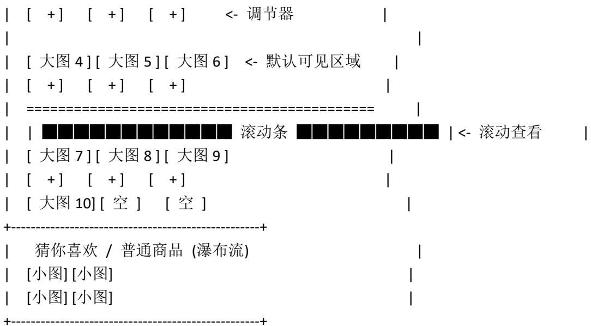

综合电商系统需求规格说明书

文档版本：V2.0

项目名称：综合电商平台系统

创建日期：2026-06-19

编制人：产品经理

审核状态：待评审

面向对象：开发、测试、UI设计、运维、运营

## 1. 项目概述

## 1.1 项目背景

随着互联网电商业务的精细化运营需求增加，平台急需一套集成了复杂促销玩法（秒杀、满减、满赠、聚划算）、会员资产体系（积分、优惠券）以及灵活后台配置的综合性购物系统。本系统旨在解决多活动冲突、优惠叠加风控问题，并提升用户购物体验。

## 1.2 核心目标

● 灵活性：运营可后台动态配置活动与优惠券，无需代码发布即可上线营销活动。

● 严谨性：严格隔离“活动优惠”与“优惠券”，杜绝资损风险。

● 体验优化：全链路支持商品数量快速调节，简化购物流程；首页布局信息密度高且交互流畅。

## 2. 总体设计

## 2.1 系统架构

● 前端：Vue.js / React (SPA 应用)，负责交互与 UI 渲染。

● 后端：微服务架构，设立独立的 “促销计算引擎 (Promotion Engine)” 负责处理互斥逻辑与价格计算。

● 数据层：MySQL 存储业务数据，Redis 缓存活动库存、会话信息及热点数据。

## 2.2 功能架构图

● 用户端：登录、首页、商品中心、购物车、个人中心、积分商城。

● 运营端：活动管理、优惠券管理、商品管理、用户管理。

● 核心逻辑：优惠互斥锁、积分结算、库存扣减、安全风控。

## 3. 详细功能需求

## 3.1 登录与账户模块

● 注册/登录：支持手机号/邮箱注册，支持密码登录与验证码快捷登录。  
● 安全：用户密码采用 MD5 + Salt 加密存储。  
● 状态保持：登录状态有效期为 7 天（Token/Cookie 机制）。

## 3.2 首页模块（布局定稿）

首页采用纵向流式布局，分为五大核心区域，各区域除 Banner 外均支持后台配置显隐与排序。

序号 区域名称 布局与交互详情

1 Banner 轮播区

● 位置：页面最顶部。  
● 规格：宽幅大图，支持自动轮播与手动滑动。  
● 交互：点击跳转至指定活动页、商品详情页或活动专区。  
● 配置：后台可配置图片 URL、跳转链接及排序权重。

2 服务图标栏

● 位置：Banner 下方，单行展示。

● 核心服务:

- 热门活动：点击进入“活动专区聚合页”。  
- 活动抽奖：点击进入抽奖转盘/刮刮乐页面，奖品为优

惠券或积分。

- 积分商城：点击跳转至积分兑换列表。  
- 每日签到：点击弹出签到弹窗，领取积分。  
- 会员中心：点击跳转至会员权益页。

● 配置：后台可配置图标样式、名称及跳转路由。

3 动态活动栏

● 位置：服务栏下方。  
- 逻辑：后台开启了“首页展示”开关的单个活动（如秒一个独立的横向滑动楼层。  
● 展示：显示活动头图/标题、倒计时（秒杀）、商品列表

(横向滑动，带数量调节器)。

● 交互：点击楼层标题右侧的“更多”可进入该活动的专

属详情页。

4 热门商品排行栏

● 位置：动态活动栏下方。  
● 数据源：按销量/热度取前 10 名商品。  
- UI布局:

\- 卡片规格：大商品图，视觉占比大，每行展示 3 个商

品卡片。

- 默认展示：默认展示前 6 个 商品（即占据 2 行高度）。  
- 滚动交互：容器高度固定，超出 2 行部分隐藏。用户可

通过鼠标滚轮或拖动滚动条查看第 7 至第 10 名的商品。

\- 数量调节：每个卡片下方配有 “+/-” 调节器，支持

手动输入数量。

● 交互：点击商品图跳转详情，点击“加入购物车”按设

定数量添加。

5 普通商品栏

● 位置：热门排行下方，瀑布流形式。

\- 分类 TAB：顶部有分类 Tab（如：精选、数码、服饰），

点击切换下方列表。

● 布局：每行 2 个商品卡（小图模式），包含商品图、名称、带数量调节）。

● 加载：支持下拉刷新，上拉加载更多。

## 3.3 商品中心模块

## 3.3.1 商品列表页

● 展示：网格或列表形式展示商品主图、名称、价格、销量。

● 数量调节器:

○ +/ - 按钮：调整数量，范围 1～库存上限。

☐ 手动输入：支持键盘输入数字，失焦后校验合法性（必须为正整数且 $\leqslant$ 库存）。

● 筛选与排序：支持按热度、价格、新品排序；按品牌、分类筛选。

## 3.3.2 商品详情页

● 活动标识：显示商品参与的优惠标签（如[秒杀]、[满减]、[聚划算]）。

● 多活动冲突拦截：若商品同时参与多种不同类型的活动，点击 “加入购物车” 或 “立即购买” 时，触发 “选择优惠方式” 弹窗（详见附录 A）。

● 数量调节：支持通过 +/- 按钮或直接输入调整购买数量。

## 3.4 购物车与结算模块

## 3.4.1 购物车管理

● 数量调节：购物车列表内的商品支持精细化的数量调节。

○ 数量为 1 时，“-”按钮置灰或提示“确认移除”。

○ 输入非法值时自动修正并 Toast 提示。

● 活动商品：显示所属活动标签。

## 3.4.2 订单结算（核心：优惠互斥）

● 优惠选择区：分为 “活动优惠” 与 “优惠券” 两个互斥板块。

● 互斥规则：活动与优惠券不可叠加使用。

○ 若用户选择 “活动”，则 “优惠券” 区域置灰。

○ 若用户选择 “优惠券”，则 “活动” 区域置灰。

● 智能推荐: 系统默认勾选能为用户省钱最多的方案, 并给出提示(如“当前活动更优惠”)。

● 二次确认：当用户试图从“活动”切换到“优惠券”时，弹出确认框：“使用优惠券将不再享受活动折扣，是否继续？”

## 3.5 个人中心模块

子模块

需求详情

--------

订单管理 状态流：待付款 -> 待发货 -> 待收货 -> 待评价 -> 已完成。支持退款/售后操作。

会员积分 ● 获取：订单状态变为“已完成”后发放，换算比例为 100 元 = 10 积分（不足 100 元部分不累计）。

● 使用：积分商城兑换虚拟或实物礼品。

地址管理 支持增、删、改、查收货地址，支持设置默认收货地址。

我的收藏展示收藏的商品列表，支持取消收藏及一键加入购物车。

## 3.6 积分商城模块

● 兑换：使用积分兑换礼品，无需现金支付，仅扣减积分。  
● 记录：生成独立的积分兑换订单，可查看物流状态。

## 3.7 后台运营系统

## 3.7.1 活动管理

● 支持类型：秒杀（限时/限量/限购）、满减（阶梯）、满赠（赠品管理）、聚划算（团购）。  
● 配置项：活动名称、时间、Banner、参与商品、规则配置（JSON 格式）、投放渠道（首页/专区）、权重排序、状态控制（启用/停用/预热）。

## 3.7.2 优惠券管理

● 商品优惠券：仅限指定 SKU 或 SPU 使用。  
● 订单优惠券：全单或指定类目满额使用。  
● 配置项：面值、门槛、有效期（固定时间/领券后 N 天）、发行量、限领规则、适用商品范围。

## 3.8 活动专区页面

● 入口：首页“热门活动”服务图标。  
● 展示：以卡片列表形式展示所有进行中/预热活动，标注活动类型标签（秒杀/满减等）。  
● 跳转：点击卡片进入对应活动的商品列表页。

## 4. 非功能性需求

● 性能：首屏加载时间 $\leqslant$ 3 秒；支持 $\geqslant$ 500 并发用户；秒杀场景需具备高并发处理能力（引入队列、缓存预热）。  
● 安全性：防 SQL 注入、XSS 攻击；支付与积分接口需签名验证，防止数据篡改。  
- 兼容性：Web 端兼容 Chrome, Firefox, Edge, Safari 主流版本；移动端适配 iOS/Android 主流分辨率（响应式设计）。

## 5. 数据字典（核心表）

表名

核心字段

说明

Orders order\_id, user\_id, total\_amount, promotion\_info(JSON) 订单主表。promotion\_info 记录优惠快照（如 {"type":"ACTIVITY", "id":123}），用于财务对账。

Promotion\_Activity activity\_id, type, rule\_config(JSON), is\_show\_home 活动表。存储满减阶梯、秒杀价等规则。

Coupon\_Template coupon\_id, type(1=商品券,2=订单券), value, min\_amount 优惠券模板表。

User\_Coupon id, user\_id, coupon\_id, status 用户持有券

表。status: 0=未用, 1=锁定, 2=已用, 3=过期。

Points\_Log log\_id, user\_id, change\_value, related\_order\_id 积分流水表。记录积分的获取与消耗。

附录 A: UI/UX 交互详细设计

## A.1 “选择优惠方式” 弹窗 (核心交互)

## 1. 触发时机

● 商品详情页点击 “立即购买” 或 “加入购物车”，且该商品同时参与多种不同类型的活动。  
● 购物车结算页，存在可用活动与可用优惠券冲突时。

## 2. 弹窗 UI 布局 (Mockup)

| 选择优惠方式

X

温馨提示：活动优惠与优惠券不可叠加，请择一使用

| ● 【活动优惠】

| ○ 限时秒杀：¥99/件 (原价¥199)

仅剩 23:59:48 结束

○ 满赠活动：购满 299 元赠送保温杯

○ 聚划算：3 人团 ¥159/件

○ 不参与活动，按原价购买

■ 【优惠券】(点击切换将放弃活动优惠)

<table><tr><td colspan="2">|----|</td></tr><tr><td colspan="2">| [ 置灰状态 - Opacity 0.5 ]</td></tr><tr><td colspan="2">| □ 商品券: iPhone 15 专用 减 50 元 (不可点击)</td></tr><tr><td colspan="2">| □ 订单券: 满 300 减 30 (不可点击)</td></tr><tr><td colspan="2">+----+</td></tr><tr><td colspan="2">| [ 确认选择 ]</td></tr><tr><td colspan="2">+----+</td></tr></table>

## 3. 交互逻辑详解

操作行为 系统响应

初始加载 系统计算最优解。若活动更省，默认选中活动项，优惠券区域置灰（不可点击）。反之则选中优惠券，活动区域置灰。

点击置灰的优惠券弹出二次确认框：“使用优惠券将不再享受活动折扣，是否继续？”

[继续]：解除优惠券置灰，选中最优券；活动区域置灰。

[取消]: 关闭弹窗，保持原状。

点击置灰的活动 若当前选中了优惠券，点击活动区域：解除活动置灰，选中最优活动；优惠券区域置灰。无需二次确认。

活动内选择 单选逻辑（Radio）。只能选择秒杀、满赠或原价中的一种。

无可用项 若没有活动，活动区显示“暂无活动”；若没有券，券区显示“暂无优惠券”。

## 附录 B: 首页布局视觉草稿

<table><tr><td colspan="2">+----+</td></tr><tr><td colspan="2">| [Banner 1] &lt;— 自动轮播 |</td></tr><tr><td colspan="2">| [Banner 2] |</td></tr><tr><td colspan="2">+----+</td></tr><tr><td colspan="2">| [热门活动][抽奖][积分商城][签到][会员] &lt;- 服务栏 |</td></tr><tr><td colspan="2">+----+</td></tr><tr><td colspan="2">| 限时秒杀 [更多&gt; ] |</td></tr><tr><td colspan="2">| ---- |</td></tr><tr><td colspan="2">| [商品A][商品B][商品C] &lt;- 横向滑动 |</td></tr><tr><td colspan="2">+----+</td></tr><tr><td colspan="2">| 热门排行榜 (共10款) |</td></tr><tr><td colspan="2">| ---- = = = = = = = = = = = = = = = = = = = = = = = = = = = = = = = = = = = = = = = = = = = = = = = = = = = = = = = = = = = = = = = = = = = = = = = = = = = = = = = = = = = = = = = = = = = = = = = = = = = =</td></tr><tr><td colspan="2">| [大图1][大图2][大图3] |</td></tr></table>

text_image

| [ + ] [ + ] [ + ] <- 调节器 |
| --- |
| [ 大图 4 ] [ 大图 5 ] [ 大图 6 ] <- 默认可见区域 |
| [ + ] [ + ] [ + ]
| ---- |
| | ■■■■■■■■■■■■■■■■■ ■ 滚动条 ■■■■■■■■■■ ■ ■ | <- 滚动查看 |
| [ 大图 7 ] [ 大图 8 ] [ 大图 9 ]
| [ + ] [ + ] [ + ]
| [ 大图 10 ] [ 空 ] [ 空 ]
+----+
| 猜你喜欢 / 普通商品 (瀑布流) |
| [小图] [小图]
| [小图] [小图]
+----+

(文档结束)